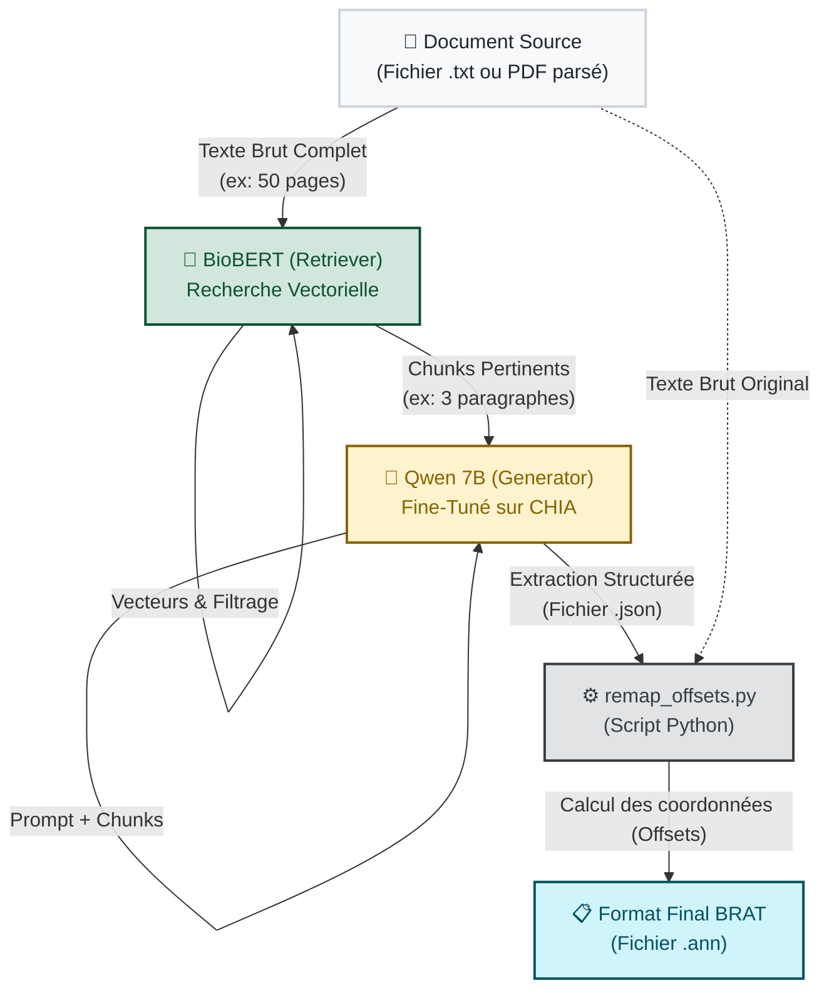

# 🧠 Architecture Détaillée de l'Extraction (BioBERT x Qwen)

Ce document décrit avec précision le flux de données au sein de la "Branche B" (Le Pipeline d'Intelligence Artificielle de notre application), spécifiant exactement ce qui entre et ce qui sort de chaque composant.

## Vue d'Ensemble du Pipeline RAG (Retrieval-Augmented Generation)

L'extraction clinique suit un processus hybride rigoureux en 4 étapes pour extraire les entités (Maladies, Traitements, Mesures...) avec précision, tout en minimisant la consommation GPU.

---

## 🔍 Étape 1 : Le "Retriever" (BioBERT)

**Rôle :** Trouver l'information pertinente (Le Bibliothécaire).

*   **Entrée :** 
    *   Le document source intégral (souvent un gros PDF médical parsé en texte brut `.txt`).
    *   Une *Requête système* (ex: "Critères d'inclusion et d'exclusion").
*   **Traitement :** BioBERT segmente le document complet en "chunks" (petits paragraphes). Il transforme chaque chunk en vecteurs mathématiques (Embeddings) et les compare à la requête système.
*   **Sortie :** 
    *   Le texte brut des 2 ou 3 paragraphes les plus pertinents (Filtrage). Le reste du document est ignoré pour ne pas surcharger la mémoire.

---

## 🧠 Étape 2 : Le "Generator" (Qwen 7B Fine-Tuné)

**Rôle :** Comprendre le texte et extraire l'information (Le Médecin Analyste).

*   **Entrée :** 
    *   Le "Prompt" complet, qui contient les paragraphes filtrés par BioBERT et l'ordre d'extraire les entités CHIA.
*   **Traitement :** Grâce à son Fine-Tuning par la méthode QLoRA (4-bit), Qwen reconnaît la structure linguistique des paragraphes et identifie les entités médicales spécifiques au standard CHIA (Condition, Drug, Measurement, etc.).
*   **Sortie :** 
    *   Un objet textuel au format **`.json`**. 
    *   *Exemple de sortie :* `{"Condition": ["diabète de type 2"], "Drug": ["Metformine"]}`

---

## ⚙️ Étape 3 : Le Post-Processing (Génération du `.ann`)

**Rôle :** Préparer la donnée pour l'affichage graphique ou le calcul des métriques (L'Ingénieur).

*   **Entrée :**
    *   Le fichier **`.json`** généré par Qwen.
    *   Le document source intégral en **`.txt`**.
*   **Traitement :** Un script Python (`remap_offsets.py`) prend les mots extraits par l'IA dans le JSON (ex: "diabète"), cherche leur position exacte dans le texte brut d'origine, et calcule les "Offsets" (ex: "diabète" commence au 124ème caractère et se termine au 131ème).
*   **Sortie :**
    *   Un fichier au standard BRAT : **`.ann`**. Ce fichier contient les mots extraits et leurs coordonnées exactes, prêt à être ingéré par l'interface utilisateur pour surligner les mots en couleur dans le PDF !
